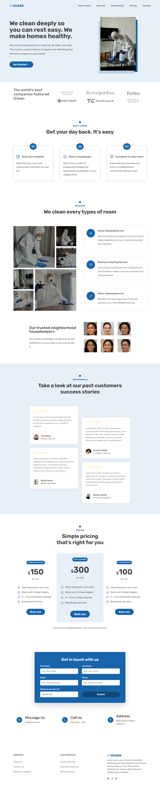

# iClean

My first project after completing the "Build Responsive Real-World Websites with HTML and CSS" course by Jonas Schmedtmann on Udemy

## Resources:

> Typography

- [OpenColor](https://yeun.github.io/open-color/)
- [Tints and Shades](https://maketintsandshades.com/)
- [Contrast Checker](https://coolors.co/contrast-checker/444444-e8f0f7)

> Illustrations

- [Pexels](https://www.pexels.com/)

## Screenshots

